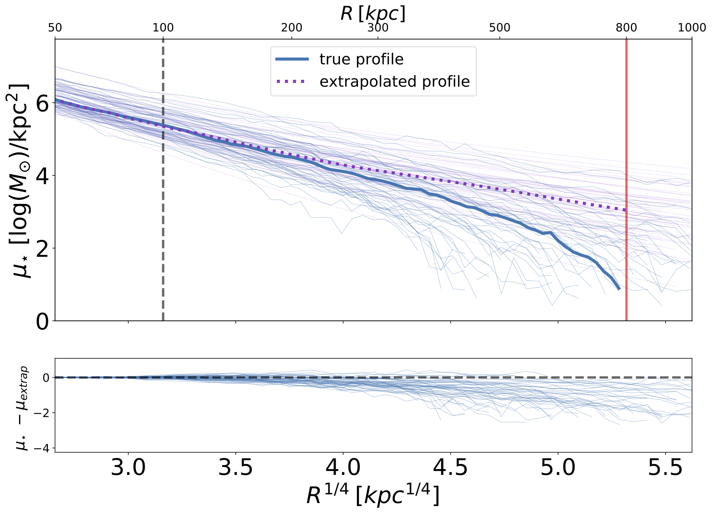
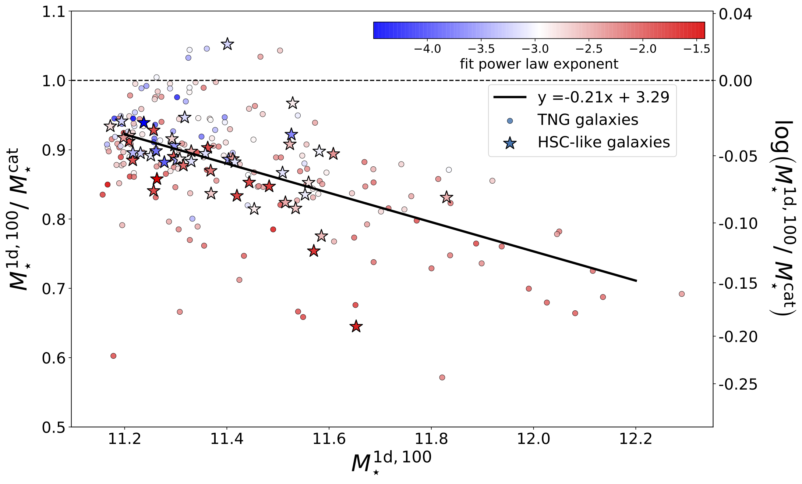
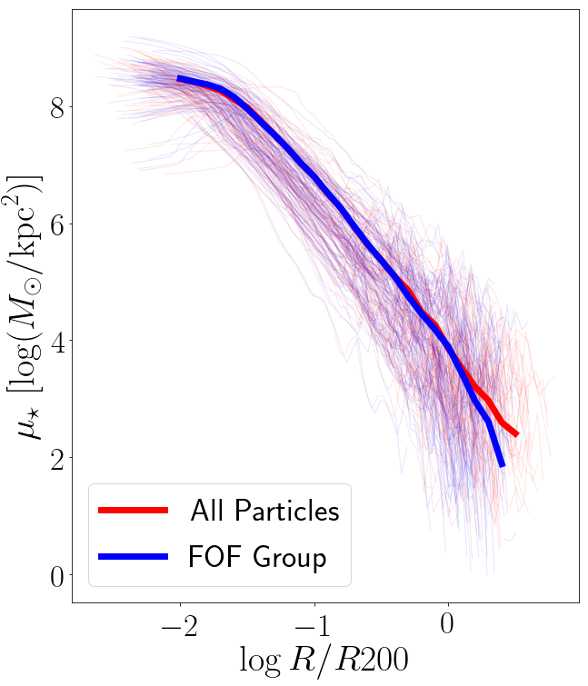

# Reaching for the Edge
A spinoff (Paper 2) of [HSC vs. hydro](https://github.com/f-ardila/HSC_vs_hydro).

**Project Goal**: Finding the edges of galaxies in simulations in order to measure their "total" stellar mass. 

In [Paper 1](https://ui.adsabs.harvard.edu/abs/2021MNRAS.500..432A/abstract), we were measuring the stellar mass profiles of galaxies, which gives us mass at different radii. As a way to check our measurements, we wanted to compare our measurements to other mass definitions (see below). This lead us to ask questions about what is the "total" mass of a galaxy. We also noticed that some of our galaxies showed a falling off in their mass profile at very large radii (~800kpc) so we wondered if we were seeing the "edges" of galaxies. We learned from Benedikt that the FOF algorithm misses a lot of mass at large radii (>R500c) so we wanted to investigate this effect to see if that is what we are seeing.

## What we've done so far
- ### Measure different mass definitions

   - M\* cat ("catalog mass"): sum of all stellar particles bound (FOF) to the subhalo of the galaxy as given by the catalogs provided by Benedikt. We haves tested that including "fuzz" (unbounded particles) is only a negligible addition to M* cat. Hence for the reminder of this paper, we ignore unbound particles and consider M\* cat to be the total mass of the galaxy. In Illustris and TNG the stellar mass of each particle is given by the initial particle mass multiplied by a mass loss function for that particle.

   - M\* 1D, r ("1D mass"): mass derived from integrating mass density profile out to _r_ kpc. For example, M* 1D, 100 is derived from integrating mass density profile to 100 kpc. This is the mass measurement we compare with observations in [Paper 1](https://ui.adsabs.harvard.edu/abs/2021MNRAS.500..432A/abstract).
   
   - M\* 2D, r ("2D mass"): mass summed within an 2D elliptical aperture with a _r_ kpc semi-major axis on the 2D projected mass map assuming  a flux-weighted average isophotal shape.

   - M\* extrap ("extrapolated mass"): stellar mass enclosed in larger aperture inferred by extrapolating the 1D profile to 800 kpc using power-fit of the surface density profile between 50 and 100 kpc. This can be applied to real data as a better proxy of "total'' stellar mass.

- ### Fit a power law to mass profile

- ### Attempt to correlate M100/Mcat to various galaxy shape properties with the goal of deriving a correction factor that can be applied to M100 to derive catalog mass 

- ### Check FOF bias
   - Conventional wisdom was that FOF groups (and thus our maps, profiles etc) should be complete out to ~Rvir, but some groups recently found that it’s MUCH WORSE than expected (the effect becoming stronger at high z).
   - Benedikt made [some plots](figures/Benedikt) testing this effect by comparing the FOF profiles against the full particle distribution. The plots show the “completeness” of the profile, i.e., the profile of FOF particles divided by all particles, for four redshifts (0, 0.5, 1, 2 = snapshots 99, 67, 50, 33). At each redshift, he extracted 100 random halos above M500c = 1E13 from TNG300-2.
   - At z = 0.5 the stars are pretty OK (though not 100% complete) out to about R500c (note that R200c ~ 1.5 R500c). However, plotting the stellar profiles out to R200c is not! At least not if one cares to the 10% level. The effect gets way worse towards higher z. At z = 2, halos are much closer to each other, and we start to lose significant fractions of particles.

## Next steps 
- Further studying question of missing mass in FOF groups
- Mass comparisons with ALL particles
- Fitting a 2D Sersic model of the profile
   - Song's examples:
      - [Notebook](https://github.com/dr-guangtou/hsc_massive/blob/master/notebooks/simulation/tng_imfit_test.ipynb)
      - [Functions](https://github.com/dr-guangtou/hsc_massive/blob/master/notebooks/simulation/fit_tng.py)

## Other useful info
- [Overleaf draft](https://www.overleaf.com/project/5d126793ff8aa833ffaec43e)
